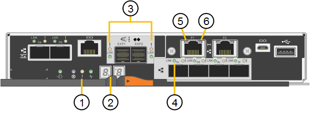

= Indicatori di stato sul controller E5700SG
:allow-uri-read: 
:icons: font
:imagesdir: ../media/

[role="lead"]
Il display a sette segmenti e i LED sul controller E5700SG mostrano codici di stato e di errore durante l'accensione dell'appliance e durante l'inizializzazione dell'hardware. È possibile utilizzare questi display per determinare lo stato e risolvere gli errori.

Una volta avviato il programma di installazione dell'appliance StorageGRID, è necessario esaminare periodicamente gli indicatori di stato sul controller E5700SG.

|===
|  | Display | Descrizione 

 a| 
1
 a| 
LED di attenzione
 a| 
Ambra: Il controller è guasto e richiede l'attenzione dell'operatore oppure lo script di installazione non è stato trovato.

OFF: Il controller funziona normalmente.

 a| 
2
 a| 
Display a sette segmenti
 a| 
Mostra un codice diagnostico

Le sequenze di visualizzazione a sette segmenti consentono di comprendere gli errori e lo stato operativo dell'appliance.

 a| 
3
 a| 
LED di attenzione della porta di espansione
 a| 
Ambra: Questi LED sono sempre di colore ambra (nessun collegamento stabilito) perché l'appliance non utilizza le porte di espansione.

 a| 
4
 a| 
LED di stato del collegamento della porta host
 a| 
Verde: Il collegamento è attivo.

OFF: Il collegamento non è attivo.

 a| 
5
 a| 
LED di stato del collegamento Ethernet
 a| 
Verde: Viene stabilito un collegamento.

OFF: Nessun collegamento stabilito.

 a| 
6
 a| 
LED di attività Ethernet
 a| 
Verde: Il collegamento tra la porta di gestione e il dispositivo a cui è collegata (ad esempio uno switch Ethernet) è attivo.

OFF: Non è presente alcun collegamento tra il controller e il dispositivo collegato.

Verde lampeggiante: È presente un'attività Ethernet.

|===

== Codici generali di boot

Durante l'avvio o dopo una reimpostazione a freddo dell'appliance, si verifica quanto segue:

. Il display a sette segmenti sul controller E5700SG mostra una sequenza generale di codici non specifici del controller. La sequenza generale termina con i codici AA e FF.
. Vengono visualizzati i codici di avvio specifici del controller E5700SG.

== Codici di avvio del controller E5700SG

Durante il normale avvio dell'appliance, il display a sette segmenti del controller E5700SG mostra i seguenti codici nell'ordine indicato:

|===
| Codice | Indica 

 a| 
CIAO
 a| 
Lo script di boot master è stato avviato.

 a| 
PP
 a| 
Il sistema sta verificando se l'FPGA deve essere aggiornato.

 a| 
HP
 a| 
Il sistema sta verificando se è necessario aggiornare il firmware del controller 10/25-GbE.

 a| 
RB
 a| 
Il sistema viene riavviato dopo l'applicazione degli aggiornamenti del firmware.

 a| 
FP
 a| 
I controlli di aggiornamento del firmware del sottosistema hardware sono stati completati. Avvio dei servizi di comunicazione tra controller in corso.

 a| 
LUI
 a| 
Il sistema è in attesa di connettività con il controller E2800 e di sincronizzazione con il sistema operativo SANtricity.

*Nota:* se questa procedura di avvio non procede oltre questa fase, controllare i collegamenti tra i due controller.

 a| 
HC
 a| 
Il sistema sta verificando la presenza di dati di installazione di StorageGRID.

 a| 
HO
 a| 
Il programma di installazione dell'appliance StorageGRID è in esecuzione.

 a| 
HA
 a| 
StorageGRID è in esecuzione.

|===

== Codici di errore della centralina E5700SG

Questi codici rappresentano le condizioni di errore che potrebbero essere visualizzate sul controller E5700SG all'avvio dell'appliance. Se si verificano errori hardware specifici di basso livello, vengono visualizzati altri codici esadecimali a due cifre. Se uno di questi codici persiste per più di un secondo o due, o se non si riesce a risolvere l'errore seguendo una delle procedure di risoluzione dei problemi prescritte, contattare il supporto tecnico.

|===
| Codice | Indica 

 a| 
22
 a| 
Nessun record di boot master trovato su qualsiasi dispositivo di boot.

 a| 
23
 a| 
Il disco flash interno non è collegato.

 a| 
2A, 2B
 a| 
Bus bloccato, impossibile leggere i dati SPD DIMM.

 a| 
40
 a| 
DIMM non validi.

 a| 
41
 a| 
DIMM non validi.

 a| 
42
 a| 
Test della memoria non riuscito.

 a| 
51
 a| 
Errore di lettura SPD.

 a| 
da 92 a 96
 a| 
Inizializzazione del bus PCI.

 a| 
Da A0 ad A3
 a| 
Inizializzazione del disco SATA.

 a| 
AB
 a| 
Codice di boot alternativo.

 a| 
AE
 a| 
Avvio del sistema operativo.

 a| 
EEA
 a| 
Training DDR4 non riuscito.

 a| 
E8
 a| 
Memoria non installata.

 a| 
UE
 a| 
Impossibile trovare lo script di installazione.

 a| 
EP
 a| 
L'installazione o la comunicazione con il controller E2800 non è riuscita.

|===
.Informazioni correlate
xref:troubleshooting-hardware-installation.adoc[Risoluzione dei problemi relativi all'installazione dell'hardware (SG5700)]

https://mysupport.netapp.com/site/global/dashboard["Supporto NetApp"^]
