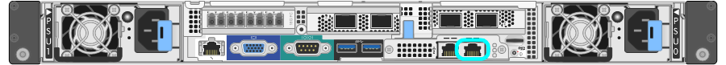

= Accedere al programma di installazione dell'appliance StorageGRID
:allow-uri-read: 
:icons: font
:imagesdir: ../media/

[role="lead"]
È necessario accedere al programma di installazione dell'appliance StorageGRID per verificare la versione del programma di installazione e configurare le connessioni tra l'appliance e le tre reti StorageGRID: Rete griglia, rete amministrativa (opzionale) e rete client (opzionale).

.Di cosa hai bisogno
* Si sta utilizzando qualsiasi client di gestione in grado di connettersi alla rete amministrativa di StorageGRID o si dispone di un laptop di assistenza.
* Il laptop client o di servizio dispone di un browser Web supportato.
* Il controller SG6000-CN è collegato a tutte le reti StorageGRID che si intende utilizzare.
* Si conoscono l'indirizzo IP, il gateway e la subnet del controller SG6000-CN su queste reti.
* Sono stati configurati gli switch di rete che si intende utilizzare.

.A proposito di questa attività
Per accedere inizialmente al programma di installazione dell'appliance StorageGRID, è possibile utilizzare l'indirizzo IP assegnato da DHCP per la porta della rete amministrativa sul controller SG6000-CN (supponendo che il controller sia collegato alla rete amministrativa) oppure collegare un laptop di assistenza direttamente al controller SG6000-CN.

.Fasi
. Se possibile, utilizzare l'indirizzo DHCP della porta di rete amministrativa del controller SG6000-CN per accedere al programma di installazione dell'appliance StorageGRID.
+
image::../media/sg6000_cn_admin_network_port.gif[Admin Network port sul controller SG6000-CN]

+
.. Individuare l'etichetta dell'indirizzo MAC sulla parte anteriore del controller SG6000-CN e determinare l'indirizzo MAC della porta Admin Network.
+
L'etichetta dell'indirizzo MAC elenca l'indirizzo MAC per la porta di gestione BMC.

+
Per determinare l'indirizzo MAC della porta Admin Network, è necessario aggiungere *2* al numero esadecimale sull'etichetta. Ad esempio, se l'indirizzo MAC sull'etichetta termina con *09*, l'indirizzo MAC della porta di amministrazione terminerà con *0B*. Se l'indirizzo MAC sull'etichetta termina in *(_y_)FF*, l'indirizzo MAC per la porta di amministrazione terminerà in *(_y_+1)01*. È possibile eseguire facilmente questo calcolo aprendo Calculator in Windows, impostandolo sulla modalità Programmer, selezionando Hex, digitando l'indirizzo MAC e digitando *+ 2 =*.

.. Fornire l'indirizzo MAC all'amministratore di rete, in modo che possa cercare l'indirizzo DHCP dell'appliance nella rete di amministrazione.
.. Dal client, inserire questo URL per il programma di installazione dell'appliance StorageGRID: +
`*https://_Appliance_Controller_IP_:8443*`
+
Per `_SG6000-CN_Controller_IP_`, Utilizzare l'indirizzo DHCP.

.. Se viene richiesto un avviso di protezione, visualizzare e installare il certificato utilizzando l'installazione guidata del browser.
+
L'avviso non verrà visualizzato al successivo accesso a questo URL.

+
Viene visualizzata la pagina iniziale del programma di installazione dell'appliance StorageGRID. Le informazioni e i messaggi visualizzati al primo accesso a questa pagina dipendono dalla modalità di connessione dell'appliance alle reti StorageGRID. Potrebbero essere visualizzati messaggi di errore che verranno risolti nelle fasi successive.

+
image::../media/appliance_installer_home_5700_5600.png[Schermata della parte superiore della home page del programma di installazione dell'appliance StorageGRID webscale]

. Se non è possibile ottenere un indirizzo IP utilizzando DHCP, è possibile utilizzare una connessione link-local.
+
.. Collegare un laptop di assistenza direttamente alla porta RJ-45 più a destra del controller SG6000-CN utilizzando un cavo Ethernet.
+

.. Aprire un browser Web sul laptop di assistenza.
.. Inserire questo URL per il programma di installazione dell'appliance StorageGRID: +
`*\https://169.254.0.1:8443*`
+
Viene visualizzata la pagina iniziale del programma di installazione dell'appliance StorageGRID. Le informazioni e i messaggi visualizzati al primo accesso a questa pagina dipendono dalla modalità di connessione dell'appliance.

+

NOTE: Se non è possibile accedere alla home page tramite una connessione link-local, configurare l'indirizzo IP del laptop di servizio come `169.254.0.2`e riprovare.

.Al termine
Dopo aver effettuato l'accesso al programma di installazione dell'appliance StorageGRID:

* Verificare che la versione del programma di installazione dell'appliance StorageGRID corrisponda alla versione software installata sul sistema StorageGRID. Se necessario, aggiornare il programma di installazione dell'appliance StorageGRID.
+
xref:verifying-and-upgrading-storagegrid-appliance-installer-version.adoc[Verificare e aggiornare la versione del programma di installazione dell'appliance StorageGRID]

* Esaminare tutti i messaggi visualizzati nella home page del programma di installazione dell'appliance StorageGRID e configurare la configurazione del collegamento e dell'IP, secondo necessità.

.Informazioni correlate
xref:../admin/web-browser-requirements.adoc[Requisiti del browser Web]
