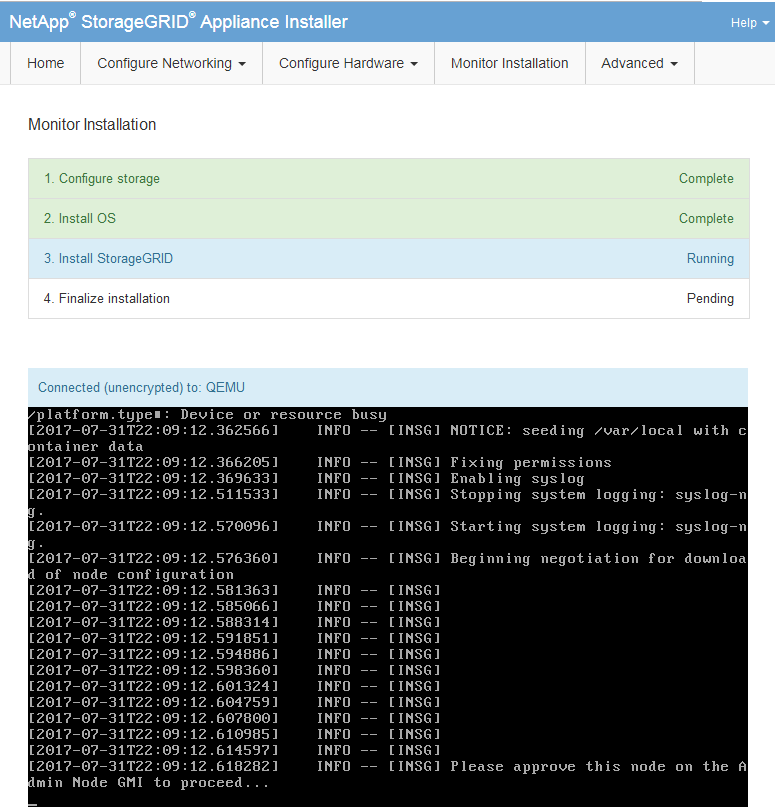

= Monitorare l'installazione delle appliance di storage
:allow-uri-read: 
:icons: font
:imagesdir: ../media/

[role="lead"]
Il programma di installazione dell'appliance StorageGRID indica lo stato fino al completamento dell'installazione. Una volta completata l'installazione del software, l'appliance viene riavviata.

.Fasi
. Per monitorare l'avanzamento dell'installazione, fare clic su *Monitor Installation* (Installazione monitor).
+
La pagina Monitor Installation (Installazione monitor) mostra lo stato di avanzamento dell'installazione.

+
image::../media/monitor_installation_configure_storage.gif[Questa immagine viene spiegata dal testo circostante.]

+
La barra di stato blu indica l'attività attualmente in corso. Le barre di stato verdi indicano le attività completate correttamente.

+

NOTE: Il programma di installazione garantisce che le attività completate in un'installazione precedente non vengano rieseguite. Se si esegue nuovamente un'installazione, tutte le attività che non devono essere rieseguite vengono visualizzate con una barra di stato verde e lo stato "`Skipped`".

. Esaminare i progressi delle prime due fasi di installazione.
+
*1. Configurare lo storage*

+
Durante questa fase, il programma di installazione si connette al controller dello storage, cancella qualsiasi configurazione esistente, comunica con il software SANtricity per configurare i volumi e configura le impostazioni dell'host.

+
*2. Installare il sistema operativo*

+
In questa fase, il programma di installazione copia l'immagine del sistema operativo di base per StorageGRID nell'appliance.

. Continuare a monitorare lo stato di avanzamento dell'installazione fino a quando la fase *Install StorageGRID* (Installazione guidata) non viene interrotta e sulla console integrata viene visualizzato un messaggio che richiede di approvare questo nodo nel nodo di amministrazione utilizzando Gestione griglia. Passare alla fase successiva.
+

. Accedere al Grid Manager del nodo Amministratore principale, approvare il nodo di storage in sospeso e completare il processo di installazione di StorageGRID.
+
Facendo clic su *Install* (Installa) da Grid Manager, viene completata la fase 3 e viene avviata la fase 4, *Finalize Installation* (completamento dell'installazione). Al termine della fase 4, il controller viene riavviato.

