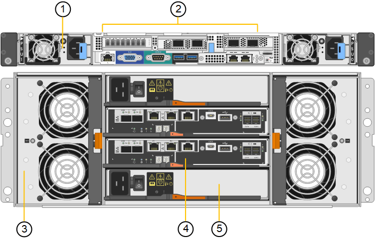

= Appliance SG6060 e SG6060X
:allow-uri-read: 
:icons: font
:imagesdir: ../media/

[role="lead"]
Le appliance StorageGRID SG6060 e SG6060X includono un controller di calcolo e uno shelf di storage controller che contiene due storage controller e 60 dischi. In alternativa, è possibile aggiungere shelf di espansione da 60 dischi a entrambe le appliance. Non esistono differenze di specifiche o di funzionalità tra SG6060 e SG6060X, ad eccezione della posizione delle porte di interconnessione sul controller storage.

== Componenti SG6060 e SG6060X

Le appliance SG6060 e SG660X includono i seguenti componenti:

[cols="1a,2a"]
|===
| Componente | Descrizione 

 a| 
Controller di calcolo
 a| 
Controller SG6000-CN, un server con un'unità rack (1U) che include:

* 40 core (80 thread)
* 192 GB DI RAM
* Fino a 4 × 25 Gbps di larghezza di banda Ethernet aggregata
* Interconnessione Fibre Channel (FC) da 4 × 16 Gbps
* Baseboard Management Controller (BMC) che semplifica la gestione dell'hardware
* Alimentatori ridondanti

 a| 
Shelf dello storage controller
 a| 
Shelf di controller e-Series E2860 (storage array), uno shelf 4U che include:

* Due controller della serie E2800 (configurazione duplex) per il supporto del failover del controller di storage
+
** SG6060 contiene i controller di storage E2800A
** SG6060X contiene controller storage E2800B

* Shelf di dischi a cinque cassetti in grado di contenere sessanta dischi da 3.5 pollici (2 dischi a stato solido o SSD e 58 dischi NL-SAS)
* Alimentatori e ventole ridondanti

 a| 
Opzionale: Shelf di espansione dello storage

*Nota:* gli shelf di espansione possono essere installati durante l'implementazione iniziale o aggiunti successivamente.
 a| 
Enclosure e-Series DE460C, shelf 4U che include:

* Due moduli di input/output (IOM)
* Cinque cassetti, ciascuno contenente 12 unità NL-SAS, per un totale di 60 unità
* Alimentatori e ventole ridondanti

Ogni appliance SG6060 e SG6060X può disporre di uno o due shelf di espansione per un totale di 180 dischi.

|===

== Diagrammi SG6060 e 6060X

I fronti di SG6060 e SG6060X sono identici. La figura seguente mostra la parte anteriore dell'SG6060, che include un controller di calcolo 1U e uno shelf 4U contenente due controller di storage e 60 dischi in cinque cassetti.

Vista frontale di SG6060*

image::../media/sg6060_front_view_with_and_without_bezels.gif[Vista frontale di SG6060]

[cols="1a,2a"]
|===
| Didascalia | Descrizione 

 a| 
1
 a| 
Controller di calcolo SG6000-CN con pannello anteriore

 a| 
2
 a| 
Shelf del controller E2860 con pannello anteriore (lo shelf di espansione opzionale appare identico)

 a| 
3
 a| 
Controller di calcolo SG6000-CN con pannello anteriore rimosso

 a| 
4
 a| 
Shelf del controller E2860 con pannello anteriore rimosso (lo shelf di espansione opzionale appare identico)

|===
Le seguenti figure mostrano il retro di SG6060 e SG6060X, inclusi i controller di calcolo e storage, le ventole e gli alimentatori.

Vista posteriore di SG6060*

[cols="1a,2a"]
|===
| Didascalia | Descrizione 

 a| 
1
 a| 
Alimentatore (1 di 2) per il controller di calcolo SG6000-CN

 a| 
2
 a| 
Connettori per controller di calcolo SG6000-CN

 a| 
3
 a| 
Ventola (1 di 2) per shelf di controller E2860

 a| 
4
 a| 
Controller storage e-Series E2800A (1 di 2) e connettori

 a| 
5
 a| 
Alimentatore (1 di 2) per shelf di controller E2860

|===
*SG6060X vista posteriore*

image::../media/sg6060x_rear_view.gif[Vista posteriore di SG6060x]

[cols="1a,2a"]
|===
| Didascalia | Descrizione 

 a| 
1
 a| 
Alimentatore (1 di 2) per il controller di calcolo SG6000-CN

 a| 
2
 a| 
Connettori per controller di calcolo SG6000-CN

 a| 
3
 a| 
Ventola (1 di 2) per shelf di controller E2860

 a| 
4
 a| 
Controller storage e-Series E2800B (1 di 2) e connettori

 a| 
5
 a| 
Alimentatore (1 di 2) per shelf di controller E2860

|===
*Shelf di espansione SG6060 e SG6060X*

Questa figura mostra il retro dello shelf di espansione opzionale per SG6060 e SG6060X, inclusi i moduli di input/output (IOM), le ventole e gli alimentatori. Ciascun SG6060 e SG6060X può essere installato con uno o due shelf di espansione, che possono essere inclusi nell'installazione iniziale o aggiunti in seguito.

image::../media/de460c_expansion_shelf_rear_view.gif[Ripiano di espansione posteriore]

[cols="1a,2a"]
|===
| Didascalia | Descrizione 

 a| 
1
 a| 
Ventola (1 di 2) per shelf di espansione

 a| 
2
 a| 
IOM (1 di 2) per shelf di espansione

 a| 
3
 a| 
Alimentatore (1 di 2) per shelf di espansione

|===