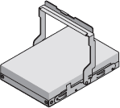

= Disimballare le scatole (SG6000)
:allow-uri-read: 
:icons: font
:imagesdir: ../media/

[role="lead"]
Prima di installare l'appliance StorageGRID, disimballare tutte le confezioni e confrontare il contenuto con gli elementi riportati sulla confezione.

== SG6060 e SG6060X

* *Controller SG6000-CN*
+
image::../media/sg6000_cn_front_without_bezel.gif[Controller SG6000-CN]

* *Shelf di controller E2860 senza unità installate*
+
image::../media/de460c_table_size.gif[Appliance 4U SG5760]

* *Due cornici anteriori*
+
image::../media/sg6000_front_bezels_for_table.gif[Cornici anteriori]

* *Due kit di guide con istruzioni*
+
image::../media/rail_kit.gif[Kit di guide]

* *60 dischi (2 SSD e 58 NL-SAS)*
+

* *Quattro maniglie*
+
image::../media/handles.gif[Maniglie SG5760]

* *Staffe posteriori e dadi a gabbia per l'installazione in rack a foro quadrato*
+
image::../media/back_brackets_table_size.gif[Staffe posteriori e dadi a gabbia per SG5760]

== Shelf di espansione SG6060 e SG6060X

* *Shelf di espansione senza unità installate*
+
image::../media/de460c_table_size.gif[Appliance 4U SG5760]

* *Pannello anteriore*
+
image::../media/front_bezel_for_table_de460c.gif[Pannello anteriore DE460C]

* *60 unità NL-SAS*
+

* *Un kit di guide con istruzioni*
+
image::../media/rail_kit.gif[Kit di guide]

* *Quattro maniglie*
+
image::../media/handles.gif[Maniglie SG5760]

* *Staffe posteriori e dadi a gabbia per l'installazione in rack a foro quadrato*
+
image::../media/back_brackets_table_size.gif[Staffe posteriori e dadi a gabbia per SG5760]

== SGF6024

* *Controller SG6000-CN*
+
image::../media/sg6000_cn_front_without_bezel.gif[Controller SG6000-CN]

* *Flash Array EF570 con 24 unità a stato solido (flash) installate*
+
image::../media/de224c_with_drives.gif[Shelf controller EF570]

* *Due cornici anteriori*
+
image::../media/sgf6024_front_bezels_for_table.png[SG6024 Bezel anteriori]

* *Due kit di guide con istruzioni*
+
image::../media/rail_kit.gif[Kit di guide]

* *Cappucci terminali shelf*
+
image::../media/endcaps.png[Cappucci terminali]

== Cavi e connettori

La spedizione per l'appliance StorageGRID include i seguenti cavi e connettori:

* *Quattro cavi di alimentazione per il tuo paese*
+
image::../media/power_cords.gif[Cavi di alimentazione]

+
Il cabinet potrebbe essere dotato di cavi di alimentazione speciali utilizzati al posto dei cavi di alimentazione forniti con l'apparecchio.

* *Cavi ottici e ricetrasmettitori SFP*
+
image::../media/fc_cable_and_sfp.gif[Cavi ottici e SFP]

+
Quattro cavi ottici per le porte di interconnessione FC

+
Quattro ricetrasmettitori SFP+ che supportano FC a 16 GB/s.

* *Opzionale: Due cavi SAS per il collegamento di ogni shelf di espansione SG6060 o SG6060X*
+
image::../media/sas_cable.gif[Cavi SAS]

