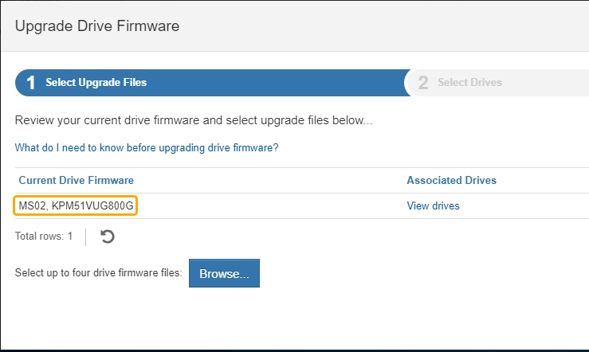

= Aggiornare il firmware del disco utilizzando Gestione di sistema di SANtricity
:allow-uri-read: 
:icons: font
:imagesdir: ../media/

[role="lead"]
Il firmware del disco viene aggiornato per assicurarsi di disporre delle funzionalità più recenti e delle correzioni dei bug.

.Di cosa hai bisogno
* Lo stato dell'appliance di storage è ottimale.
* Tutti i dischi hanno uno stato ottimale.
* È installata la versione più recente di Gestore di sistema di SANtricity compatibile con la versione di StorageGRID in uso.
* Lo hai fatto xref:placing-appliance-into-maintenance-mode.adoc[Impostare l'appliance StorageGRID in modalità di manutenzione].
+

NOTE: La modalità di manutenzione interrompe la connessione al controller di storage, interrompendo tutte le attività di i/o e mettendo tutti i dischi offline.

+

IMPORTANT: Non aggiornare il firmware del disco su più appliance StorageGRID alla volta. In questo modo, i dati potrebbero non essere disponibili, a seconda del modello di implementazione e delle policy ILM.

.Fasi
. Verificare che l'apparecchio sia in posizione xref:placing-appliance-into-maintenance-mode.adoc[modalità di manutenzione].
. Accedere a Gestore di sistema di SANtricity utilizzando uno dei seguenti metodi:
+
** Utilizzare il programma di installazione dell'appliance StorageGRID e selezionare *Avanzate* > *Gestore di sistema SANtricity*
** Utilizzare Gestione di sistema SANtricity selezionando l'IP del controller di storage: +
`*https://_Storage_Controller_IP_*`

. Se necessario, immettere il nome utente e la password dell'amministratore del gestore di sistema di SANtricity.
. Verificare la versione del firmware del disco attualmente installata nell'appliance di storage:
+
.. Da Gestione sistemi SANtricity, selezionare *SUPPORTO* > *Centro di aggiornamento*.
.. In Drive firmware upgrade (aggiornamento firmware disco), selezionare *Begin Upgrade* (Avvia aggiornamento).
+
L'opzione Upgrade Drive firmware (Aggiorna firmware unità) visualizza i file del firmware del disco attualmente installati.

.. Annotare le revisioni del firmware del disco e gli identificatori del disco correnti nella colonna firmware del disco corrente.
+

+
In questo esempio:

+
*** La revisione del firmware del disco è *MS02*.
*** L'identificatore del disco è *KPM51VUG800G*.

+
Selezionare *View drives* (Visualizza unità) nella colonna Associated Drives (unità associate) per visualizzare la posizione in cui queste unità sono installate nell'appliance di storage.

.. Chiudere la finestra Upgrade Drive firmware (Aggiorna firmware unità).

. Scaricare e preparare l'aggiornamento del firmware del disco disponibile:
+
.. In Drive firmware upgrade (aggiornamento firmware disco), selezionare *NetApp Support* (supporto NetApp).
.. Sul sito Web del supporto NetApp, selezionare la scheda *Downloads*, quindi selezionare *e-Series Disk Drive firmware*.
+
Viene visualizzata la pagina e-Series Disk firmware (firmware disco e-Series).

.. Cercare ciascun *Drive Identifier* installato nell'appliance di storage e verificare che ciascun identificatore di unità disponga della versione firmware più recente.
+
*** Se la revisione del firmware non è un collegamento, l'identificatore del disco ha la revisione del firmware più recente.
*** Se per un identificatore di unità sono elencati uno o più codici prodotto, è disponibile un aggiornamento del firmware per questi dischi. È possibile selezionare qualsiasi collegamento per scaricare il file del firmware.
+
image::../media/storagegrid_drive_firmware_download.png[Pagina firmware disco e-Series]

.. Se viene elencata una revisione del firmware successiva, selezionare il collegamento nella sezione firmware Rev. (Rev. Firmware) (Download) per scaricare un `.zip` archivio contenente il file del firmware.
.. Estrarre (decomprimere) i file di archivio del firmware del disco scaricati dal sito del supporto.

. Installare l'aggiornamento del firmware del disco:
+
.. Da Gestione sistemi SANtricity, sotto aggiornamento firmware disco, selezionare *Avvia aggiornamento*.
.. Selezionare *Browse* (Sfoglia) e selezionare i nuovi file del firmware del disco scaricati dal sito di supporto.
+
I file del firmware del disco hanno un nome file simile a +
`D_HUC101212CSS600_30602291_MS01_2800_0002.dlp`.

+
È possibile selezionare fino a quattro file del firmware del disco, uno alla volta. Se più di un file del firmware del disco è compatibile con lo stesso disco, viene visualizzato un errore di conflitto del file. Decidere quale file del firmware del disco utilizzare per l'aggiornamento e rimuovere l'altro.

.. Selezionare *Avanti*.
+
*Select Drives* elenca i dischi che è possibile aggiornare con i file del firmware selezionati.

+
Vengono visualizzati solo i dischi compatibili.

+
Il firmware selezionato per il disco viene visualizzato in *Proposed firmware* (firmware proposto). Se è necessario modificare questo firmware, selezionare *Indietro*.

.. Selezionare *Offline (Parallel)* upgrade.
+
È possibile utilizzare il metodo di aggiornamento offline perché l'appliance è in modalità di manutenzione, in cui l'attività i/o viene interrotta per tutti i dischi e tutti i volumi.

+

CAUTION: Non procedere, a meno che non si sia certi che l'apparecchio sia in modalità di manutenzione. La mancata attivazione della modalità di manutenzione dell'appliance prima dell'avvio di un aggiornamento offline del firmware del disco potrebbe causare la perdita di dati.

.. Nella prima colonna della tabella, selezionare il disco o i dischi che si desidera aggiornare.
+
La procedura consigliata consiste nell'aggiornare tutti i dischi dello stesso modello alla stessa revisione del firmware.

.. Selezionare *Start* e confermare che si desidera eseguire l'aggiornamento.
+
Per interrompere l'aggiornamento, selezionare *Stop*. Tutti i download del firmware attualmente in corso sono stati completati. Tutti i download del firmware non avviati vengono annullati.

+

IMPORTANT: L'interruzione dell'aggiornamento del firmware del disco potrebbe causare la perdita di dati o la mancata disponibilità dei dischi.

.. (Facoltativo) per visualizzare un elenco degli aggiornamenti, selezionare *Save Log* (Salva registro).
+
Il file di log viene salvato nella cartella downloads del browser con il nome `latest-upgrade-log-timestamp.txt`.

+
Se durante la procedura di aggiornamento si verifica uno dei seguenti errori, eseguire l'azione consigliata appropriata.

+
*** *Dischi assegnati non riusciti*
+
Un motivo del guasto potrebbe essere che il disco non dispone della firma appropriata. Assicurarsi che il disco interessato sia un disco autorizzato. Per ulteriori informazioni, contatta il supporto tecnico.

+
Quando si sostituisce un'unità, assicurarsi che la capacità dell'unità sostitutiva sia uguale o superiore a quella dell'unità che si sta sostituendo.

+
È possibile sostituire il disco guasto mentre lo storage array riceve i/O.

*** *Controllare lo storage array*
+
**** Assicurarsi che a ciascun controller sia stato assegnato un indirizzo IP.
**** Assicurarsi che tutti i cavi collegati al controller non siano danneggiati.
**** Assicurarsi che tutti i cavi siano collegati saldamente.

*** *Dischi hot spare integrati*
+
Questa condizione di errore deve essere corretta prima di poter aggiornare il firmware.

*** *Gruppi di volumi incompleti*
+
Se uno o più gruppi di volumi o pool di dischi sono incompleti, è necessario correggere questa condizione di errore prima di poter aggiornare il firmware.

*** *Operazioni esclusive (diverse dai supporti in background/scansione di parità) attualmente in esecuzione su qualsiasi gruppo di volumi*
+
Se sono in corso una o più operazioni esclusive, queste devono essere completate prima di poter aggiornare il firmware. Utilizzare System Manager per monitorare l'avanzamento delle operazioni.

*** *Volumi mancanti*
+
È necessario correggere la condizione del volume mancante prima di poter aggiornare il firmware.

*** *Uno dei controller in uno stato diverso da quello ottimale*
+
Uno dei controller degli array di storage richiede attenzione. Questa condizione deve essere corretta prima di poter aggiornare il firmware.

*** *Informazioni sulla partizione dello storage non corrispondenti tra i grafici a oggetti controller*
+
Si è verificato un errore durante la convalida dei dati sui controller. Contattare il supporto tecnico per risolvere il problema.

*** *SPM Verify Database Controller Check fails* (verifica controller database SPM non riuscita)
+
Si è verificato un errore nel database di mappatura delle partizioni di storage su un controller. Contattare il supporto tecnico per risolvere il problema.

*** *Configuration Database Validation (convalida del database di configurazione) (se supportata dalla versione del controller dello storage array)*
+
Si è verificato un errore del database di configurazione su un controller. Contattare il supporto tecnico per risolvere il problema.

*** *Controlli correlati a MEL*
+
Contattare il supporto tecnico per risolvere il problema.

*** *Negli ultimi 7 giorni sono stati segnalati più di 10 eventi DDE Informational o MEL critici*
+
Contattare il supporto tecnico per risolvere il problema.

*** *Negli ultimi 7 giorni sono stati segnalati più di 2 eventi critici MEL di pagina 2C*
+
Contattare il supporto tecnico per risolvere il problema.

*** *Negli ultimi 7 giorni sono stati segnalati più di 2 eventi MEL critici su Drive Channel degradati*
+
Contattare il supporto tecnico per risolvere il problema.

*** *Più di 4 voci MEL critiche negli ultimi 7 giorni*
+
Contattare il supporto tecnico per risolvere il problema.

. Se questa procedura è stata completata correttamente e si dispone di procedure aggiuntive da eseguire mentre il nodo è in modalità di manutenzione, eseguirle ora. Al termine dell'operazione, o se si verificano errori e si desidera ricominciare, selezionare *Avanzate* > *Riavvia controller*, quindi selezionare una delle seguenti opzioni:
+
** Selezionare *Riavvia in StorageGRID*
** Selezionare *Reboot into Maintenance Mode* (Riavvia in modalità di manutenzione) per riavviare il controller con il nodo in modalità di manutenzione. Selezionare questa opzione se si verificano errori durante la procedura e si desidera ricominciare. Al termine del riavvio del nodo in modalità di manutenzione, riavviare dalla fase appropriata della procedura che ha avuto esito negativo.
+
image::../media/reboot_controller_from_maintenance_mode.png[Riavviare il controller in modalità di manutenzione]

+
Il riavvio dell'appliance e il ricongiungersi alla griglia possono richiedere fino a 20 minuti. Per confermare che il riavvio è stato completato e che il nodo ha ricongiungersi alla griglia, tornare a Grid Manager. La pagina Nodes (nodi) dovrebbe visualizzare uno stato normale (nessuna icona a sinistra del nome del nodo) per il nodo appliance, a indicare che non sono attivi avvisi e che il nodo è connesso alla griglia.

+
image::../media/node_rejoin_grid_confirmation.png[Nodo appliance riconentrato in Grid]

.Informazioni correlate
xref:upgrading-santricity-os-on-storage-controllers.adoc[Aggiornare il sistema operativo SANtricity sui controller di storage]
