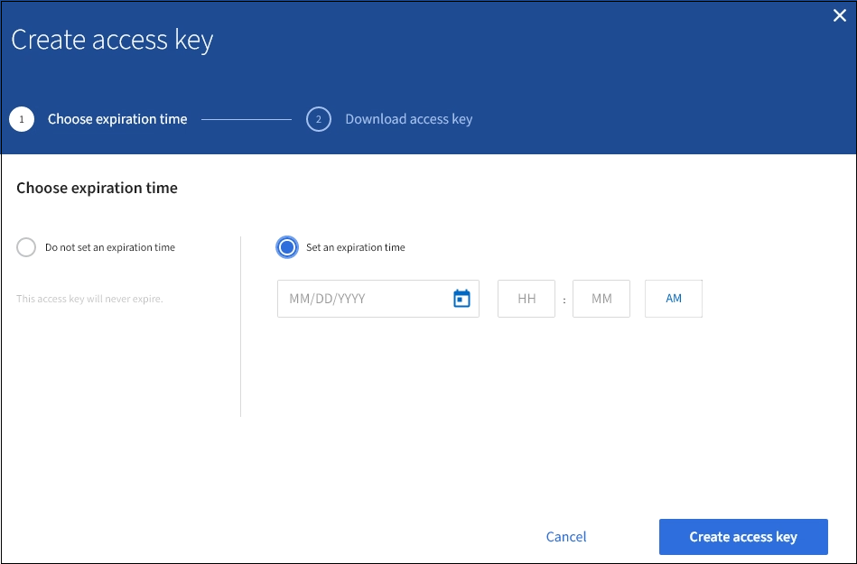

= Creare le proprie chiavi di accesso S3
:allow-uri-read: 
:icons: font
:imagesdir: ../media/

[role="lead"]
Se si utilizza un tenant S3 e si dispone dell'autorizzazione appropriata, è possibile creare le proprie chiavi di accesso S3. È necessario disporre di una chiave di accesso per accedere ai bucket e agli oggetti nell'account tenant S3.

.Di cosa hai bisogno
* È necessario accedere al tenant manager utilizzando un xref:../admin/web-browser-requirements.adoc[browser web supportato].
* È necessario disporre dell'autorizzazione Gestisci credenziali S3. Vedere xref:tenant-management-permissions.adoc[Permessi di gestione del tenant].

.A proposito di questa attività
È possibile creare una o più chiavi di accesso S3 che consentono di creare e gestire i bucket per l'account tenant. Dopo aver creato una nuova chiave di accesso, aggiornare l'applicazione con il nuovo ID della chiave di accesso e la chiave di accesso segreta. Per motivi di sicurezza, non creare più chiavi di quelle necessarie ed eliminare le chiavi non utilizzate. Se si dispone di una sola chiave e sta per scadere, creare una nuova chiave prima della scadenza della vecchia, quindi eliminare quella vecchia.

Ogni chiave può avere un tempo di scadenza specifico o nessuna scadenza. Seguire queste linee guida per la scadenza:

* Impostare una scadenza per le chiavi in modo da limitare l'accesso a un determinato periodo di tempo. L'impostazione di un breve periodo di scadenza può contribuire a ridurre il rischio in caso di esposizione accidentale dell'ID della chiave di accesso e della chiave di accesso segreta. Le chiavi scadute vengono rimosse automaticamente.
* Se il rischio di protezione nell'ambiente è basso e non è necessario creare periodicamente nuove chiavi, non è necessario impostare una scadenza per le chiavi. Se si decide in seguito di creare nuove chiavi, eliminare manualmente le vecchie chiavi.

IMPORTANT: È possibile accedere ai bucket S3 e agli oggetti appartenenti al tuo account utilizzando l'ID della chiave di accesso e la chiave di accesso segreta visualizzati per il tuo account in Tenant Manager. Per questo motivo, proteggere le chiavi di accesso come se si trattasse di una password. Ruotare regolarmente le chiavi di accesso, rimuovere eventuali chiavi inutilizzate dall'account e non condividerle mai con altri utenti.

.Fasi
. Selezionare *STORAGE (S3)* > *My access key*.
+
Viene visualizzata la pagina My access keys (i miei tasti di accesso) che elenca tutti i tasti di accesso esistenti.

. Selezionare *Crea chiave*.
. Effettuare una delle seguenti operazioni:
+
** Selezionare *non impostare una scadenza* per creare una chiave che non scadrà. (Impostazione predefinita)
** Selezionare *Set an expiration time* (Imposta data di scadenza) e impostare la data e l'ora di scadenza.
+

. Selezionare *Crea chiave di accesso*.
+
Viene visualizzata la finestra di dialogo Download access key (Scarica chiave di accesso), in cui sono elencati l'ID della chiave di accesso e la chiave di accesso segreta.

. Copiare l'ID della chiave di accesso e la chiave di accesso segreta in una posizione sicura oppure selezionare *Download .csv* per salvare un foglio di calcolo contenente l'ID della chiave di accesso e la chiave di accesso segreta.
+

IMPORTANT: Non chiudere questa finestra di dialogo prima di aver copiato o scaricato queste informazioni. Una volta chiusa la finestra di dialogo, non è possibile copiare o scaricare le chiavi.

+
image::../media/tenant_s3_access_key_save_keys.png[Schermata della finestra di dialogo Save Keys (Salva chiavi)]

. Selezionare *fine*.
+
La nuova chiave è elencata nella pagina i miei tasti di accesso. Le modifiche potrebbero richiedere fino a 15 minuti per essere effettive a causa del caching.

