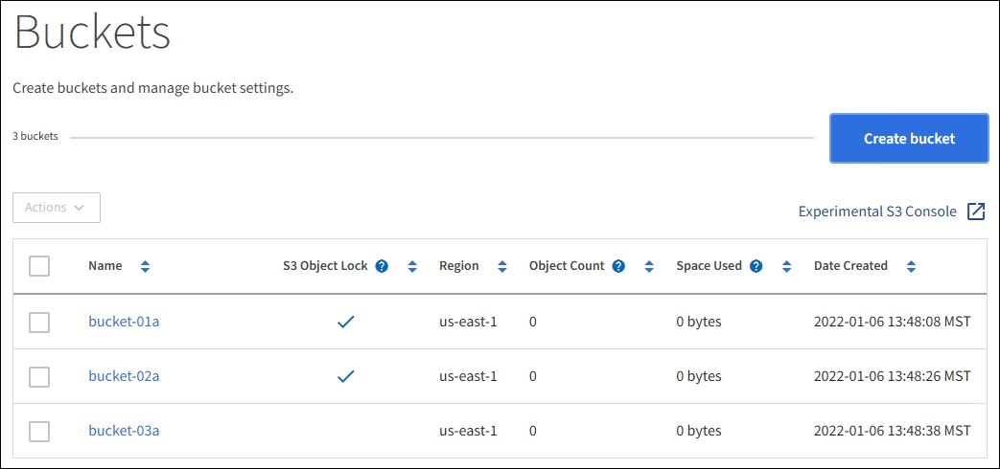

= Elimina bucket S3
:allow-uri-read: 
:icons: font
:imagesdir: ../media/

[role="lead"]
È possibile utilizzare Tenant Manager per eliminare uno o più bucket S3 vuoti.

.Di cosa hai bisogno
* È necessario accedere al tenant manager utilizzando un xref:../admin/web-browser-requirements.adoc[browser web supportato].
* È necessario appartenere a un gruppo di utenti che disponga dell'autorizzazione Manage All Bucket (Gestisci tutti i bucket) o Root Access (accesso root). Queste autorizzazioni sovrascrivono le impostazioni delle autorizzazioni nelle policy di gruppo o bucket. Vedere xref:tenant-management-permissions.adoc[Permessi di gestione del tenant].
* I bucket che si desidera eliminare sono vuoti.

.A proposito di questa attività
Queste istruzioni descrivono come eliminare un bucket S3 utilizzando il Tenant Manager. È inoltre possibile eliminare i bucket S3 utilizzando xref:understanding-tenant-management-api.adoc[API di gestione del tenant] o il xref:../s3/s3-rest-api-supported-operations-and-limitations.adoc[API REST S3].

Non è possibile eliminare un bucket S3 se contiene oggetti o versioni di oggetti non correnti. Per informazioni sull'eliminazione degli oggetti con versione S3, vedere xref:../ilm/index.adoc[istruzioni per la gestione degli oggetti con la gestione del ciclo di vita delle informazioni].

.Fasi
. Selezionare *STORAGE (S3)* > *Bucket*.
+
Viene visualizzata la pagina bucket che mostra tutti i bucket S3 esistenti.

+

. Selezionare la casella di controllo per il bucket vuoto che si desidera eliminare. È possibile selezionare più bucket alla volta.
+
Il menu Actions (azioni) è attivato.

. Dal menu Actions (azioni), selezionare *Delete bucket* (Elimina bucket) (oppure *Delete bucket* (Elimina bucket) se sono stati selezionati più bucket).
+
image::../media/delete_bucket_button.png[Pulsante Delete Bucket (Elimina bucket)]

. Quando viene visualizzata la finestra di dialogo di conferma, selezionare *Sì* per eliminare tutti i bucket scelti.
+
StorageGRID conferma che ogni bucket è vuoto e quindi elimina ogni bucket. Questa operazione potrebbe richiedere alcuni minuti.

+
Se un bucket non è vuoto, viene visualizzato un messaggio di errore. È necessario eliminare tutti gli oggetti prima di poter eliminare un bucket.

