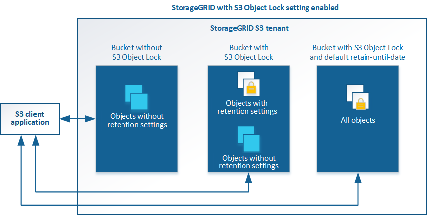

= USA blocco oggetti S3 con tenant
:allow-uri-read: 
:icons: font
:imagesdir: ../media/

[role="lead"]
È possibile utilizzare la funzione blocco oggetti S3 in StorageGRID se gli oggetti devono essere conformi ai requisiti normativi per la conservazione.

== Che cos'è il blocco oggetti S3?

La funzione blocco oggetti StorageGRID S3 è una soluzione di protezione degli oggetti equivalente a blocco oggetti S3 in Amazon Simple Storage Service (Amazon S3).

Come mostrato nella figura, quando l'impostazione globale S3 Object Lock è attivata per un sistema StorageGRID, un account tenant S3 può creare bucket con o senza S3 Object Lock abilitato. Se un bucket ha S3 Object Lock attivato, le applicazioni client S3 possono specificare le impostazioni di conservazione per qualsiasi versione di oggetto in quel bucket. Una versione dell'oggetto deve avere le impostazioni di conservazione specificate per essere protetta da S3 Object Lock.

La funzione blocco oggetto StorageGRID S3 offre una singola modalità di conservazione equivalente alla modalità di conformità Amazon S3. Per impostazione predefinita, una versione dell'oggetto protetto non può essere sovrascritta o eliminata da alcun utente. La funzione blocco oggetti di StorageGRID S3 non supporta una modalità di governance e non consente agli utenti con autorizzazioni speciali di ignorare le impostazioni di conservazione o di eliminare gli oggetti protetti.

Se in un bucket è attivato il blocco oggetti S3, l'applicazione client S3 può specificare una o entrambe le seguenti impostazioni di conservazione a livello di oggetto durante la creazione o l'aggiornamento di un oggetto:

* *Mantieni-fino-data*: Se la data di conservazione di una versione dell'oggetto è futura, l'oggetto può essere recuperato, ma non può essere modificato o cancellato. Come richiesto, è possibile aumentare la data di conservazione di un oggetto fino alla data odierna, ma non è possibile diminuarla.
* *Conservazione legale*: L'applicazione di un blocco legale a una versione oggetto blocca immediatamente tale oggetto. Ad esempio, potrebbe essere necessario sospendere legalmente un oggetto correlato a un'indagine o a una controversia legale. Una conservazione a fini giudiziari non ha una data di scadenza, ma rimane attiva fino a quando non viene esplicitamente rimossa. Le conservazioni legali sono indipendenti dalla conservazione fino alla data odierna.

Puoi anche farlo xref:../s3/operations-on-buckets.adoc#using-s3-object-lock-default-bucket-retention[specificare una modalità di conservazione predefinita e un periodo di conservazione predefinito per il bucket]. Questi vengono applicati a ciascun oggetto aggiunto al bucket che non specifica le proprie impostazioni di conservazione.

Per ulteriori informazioni su queste impostazioni, vedere xref:../s3/using-s3-object-lock.adoc[USA blocco oggetti S3].

== Gestire i bucket conformi alle versioni precedenti

La funzione blocco oggetti S3 sostituisce la funzionalità di conformità disponibile nelle versioni precedenti di StorageGRID. Se sono stati creati bucket conformi utilizzando una versione precedente di StorageGRID, è possibile continuare a gestire le impostazioni di questi bucket; tuttavia, non è più possibile creare nuovi bucket conformi. Per istruzioni, consultare l'articolo della Knowledge base di NetApp.

https://kb.netapp.com/Advice_and_Troubleshooting/Hybrid_Cloud_Infrastructure/StorageGRID/How_to_manage_legacy_Compliant_buckets_in_StorageGRID_11.5["Knowledge base di NetApp: Come gestire i bucket conformi alle versioni precedenti in StorageGRID 11.5"^]

== Workflow di blocco oggetti S3

Il diagramma del flusso di lavoro mostra i passaggi di alto livello per l'utilizzo della funzione blocco oggetti S3 in StorageGRID.

Prima di poter creare bucket con blocco oggetti S3 attivato, l'amministratore della griglia deve attivare l'impostazione di blocco oggetti S3 globale per l'intero sistema StorageGRID. L'amministratore della griglia deve inoltre assicurarsi che il xref:../ilm/index.adoc[Policy ILM (Information Lifecycle Management)] È "`compliant`"; deve soddisfare i requisiti dei bucket con S3 Object Lock abilitato. Per ulteriori informazioni, contattare l'amministratore della griglia o consultare le istruzioni per la gestione degli oggetti con la gestione del ciclo di vita delle informazioni.

Una volta attivata l'impostazione globale S3 Object Lock, è possibile creare bucket con S3 Object Lock attivato. È quindi possibile utilizzare l'applicazione client S3 per specificare facoltativamente le impostazioni di conservazione per ciascuna versione dell'oggetto.

image::../media/s3_object_lock_workflow_tenant.png[Tenore del flusso di lavoro blocco oggetti S3]

== Requisiti per il blocco oggetti S3

Prima di abilitare il blocco oggetti S3 per un bucket, esaminare i requisiti per gli oggetti e i bucket di blocco oggetti S3 e il ciclo di vita degli oggetti nei bucket con il blocco oggetti S3 attivato.

=== Requisiti per i bucket con S3 Object Lock attivato

* Se l'impostazione blocco oggetto S3 globale è attivata per il sistema StorageGRID, è possibile utilizzare Gestione tenant, API di gestione tenant o API REST S3 per creare bucket con blocco oggetto S3 attivato.
+
Questo esempio di Tenant Manager mostra un bucket con blocco oggetti S3 attivato.

+
image::../media/compliant_bucket.png[Esempio di bucket conforme]

* Se si intende utilizzare il blocco oggetti S3, è necessario attivare il blocco oggetti S3 quando si crea il bucket. Non è possibile attivare il blocco oggetti S3 per un bucket esistente.
* La versione del bucket è richiesta con S3 Object Lock. Quando il blocco oggetti S3 è attivato per un bucket, StorageGRID attiva automaticamente il controllo delle versioni per quel bucket.
* Dopo aver creato un bucket con S3 Object Lock attivato, non è possibile disattivare S3 Object Lock o sospendere il controllo delle versioni per quel bucket.
* Facoltativamente, è possibile configurare la conservazione predefinita per un bucket. Quando viene caricata una versione dell'oggetto, la conservazione predefinita viene applicata alla versione dell'oggetto. È possibile eseguire l'override del valore predefinito del bucket specificando una modalità di conservazione e conservarla fino a data nella richiesta di caricare una versione dell'oggetto.
* La configurazione del ciclo di vita del bucket è supportata per i bucket S3 Object Lifecycle.
* La replica di CloudMirror non è supportata per i bucket con blocco oggetti S3 attivato.

=== Requisiti per gli oggetti nei bucket con S3 Object Lock attivato

* Per proteggere una versione a oggetti, l'applicazione client S3 deve configurare la conservazione predefinita del bucket o specificare le impostazioni di conservazione in ogni richiesta di caricamento.
* È possibile aumentare la data di conservazione per una versione a oggetti, ma non è mai possibile diminuire questo valore.
* Se si riceve la notifica di un'azione legale o di un'indagine normativa in sospeso, è possibile conservare le informazioni pertinenti ponendo un blocco legale su una versione dell'oggetto. Quando una versione dell'oggetto è sottoposta a un blocco legale, non è possibile eliminare tale oggetto da StorageGRID, anche se ha raggiunto la data di conservazione. Non appena la conservazione legale viene revocata, la versione dell'oggetto può essere eliminata se è stata raggiunta la data di conservazione.
* S3 Object Lock richiede l'utilizzo di bucket con versione. Le impostazioni di conservazione si applicano alle singole versioni di oggetti. Una versione a oggetti può avere un'impostazione di conservazione fino alla data e un'impostazione di conservazione legale, una ma non l'altra o nessuna delle due. La specifica di un'impostazione di conservazione fino a data o di conservazione legale per un oggetto protegge solo la versione specificata nella richiesta. È possibile creare nuove versioni dell'oggetto, mentre la versione precedente rimane bloccata.

=== Ciclo di vita degli oggetti nei bucket con S3 Object Lock attivato

Ogni oggetto salvato in un bucket con S3 Object Lock attivato passa attraverso tre fasi:

. *Acquisizione oggetto*
+
** Quando si aggiunge una versione dell'oggetto a un bucket con S3 Object Lock attivato, l'applicazione client S3 può specificare facoltativamente le impostazioni di conservazione per l'oggetto (conservazione fino alla data, conservazione legale o entrambe). StorageGRID genera quindi metadati per l'oggetto, che includono un UUID (Unique Object Identifier) e la data e l'ora di acquisizione.
** Dopo l'acquisizione di una versione a oggetti con impostazioni di conservazione, i relativi dati e i metadati S3 definiti dall'utente non possono essere modificati.
** StorageGRID memorizza i metadati dell'oggetto indipendentemente dai dati dell'oggetto. Conserva tre copie di tutti i metadati degli oggetti in ogni sito.

. *Conservazione degli oggetti*
+
** StorageGRID memorizza più copie dell'oggetto. Il numero e il tipo esatti di copie e le posizioni di storage sono determinati dalle regole conformi nel criterio ILM attivo.

. *Eliminazione di oggetti*
+
** È possibile eliminare un oggetto una volta raggiunta la data di conservazione.
** Non è possibile eliminare un oggetto sottoposto a conservazione a fini giudiziari.

