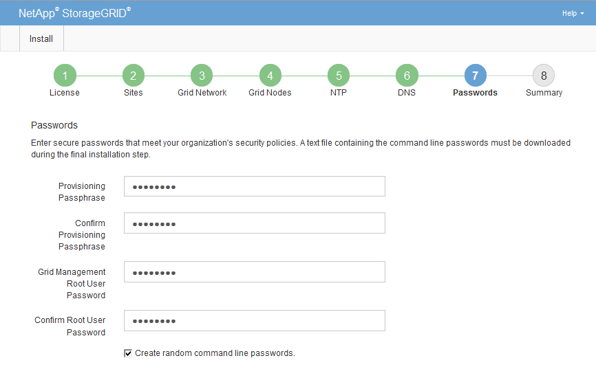

= Specificare le password di sistema di StorageGRID
:allow-uri-read: 
:icons: font
:imagesdir: ../media/

[role="lead"]
Durante l'installazione del sistema StorageGRID, è necessario inserire le password da utilizzare per proteggere il sistema ed eseguire attività di manutenzione.

.A proposito di questa attività
Utilizzare la pagina Installa password per specificare la passphrase di provisioning e la password utente root di gestione della griglia.

* La passphrase di provisioning viene utilizzata come chiave di crittografia e non viene memorizzata dal sistema StorageGRID.
* È necessario disporre della passphrase di provisioning per le procedure di installazione, espansione e manutenzione, incluso il download del pacchetto di ripristino. Pertanto, è importante memorizzare la passphrase di provisioning in una posizione sicura.
* È possibile modificare la passphrase di provisioning da Grid Manager, se si dispone di quella corrente.
* La password utente root della gestione della griglia può essere modificata utilizzando Grid Manager.
* Le password SSH e la console della riga di comando generate in modo casuale sono memorizzate nel file Passwords.txt nel pacchetto di ripristino.

.Fasi
. In *Provisioning Passphrase*, immettere la passphase di provisioning necessaria per apportare modifiche alla topologia grid del sistema StorageGRID.
+
Memorizzare la passphrase di provisioning in un luogo sicuro.

+

NOTE: Se, al termine dell'installazione, si desidera modificare la passphrase di provisioning in un secondo momento, è possibile utilizzare Grid Manager. Selezionare *CONFIGURATION* > *Access control*> *Grid passwords*.

. In *Confirm Provisioning Passphrase* (Conferma password di provisioning), immettere nuovamente la passphrase di provisioning per confermarla.
. In *Grid Management Root User Password*, inserire la password da utilizzare per accedere a Grid Manager come utente "`root`".
+
Memorizzare la password in un luogo sicuro.

. In *Confirm Root User Password* (Conferma password utente root), immettere nuovamente la password di Grid Manager per confermarla.
+

. Se si sta installando una griglia a scopo dimostrativo o dimostrativo, deselezionare la casella di controllo *Crea password della riga di comando casuale*.
+
Per le implementazioni in produzione, le password casuali devono essere sempre utilizzate per motivi di sicurezza. Deselezionare *Create random command line passwords* only for demo grid se si desidera utilizzare le password predefinite per accedere ai nodi della griglia dalla riga di comando utilizzando l'account "`root`" o "`admin`".

+

IMPORTANT: Viene richiesto di scaricare il file del pacchetto di ripristino (`sgws-recovery-package-id-revision.zip`) Dopo aver fatto clic su *Install* (Installa) nella pagina Summary (Riepilogo). È necessario xref:../maintain/downloading-recovery-package.adoc[scarica questo file] per completare l'installazione. Le password necessarie per accedere al sistema sono memorizzate nel file Passwords.txt, contenuto nel file Recovery Package.

. Fare clic su *Avanti*.

