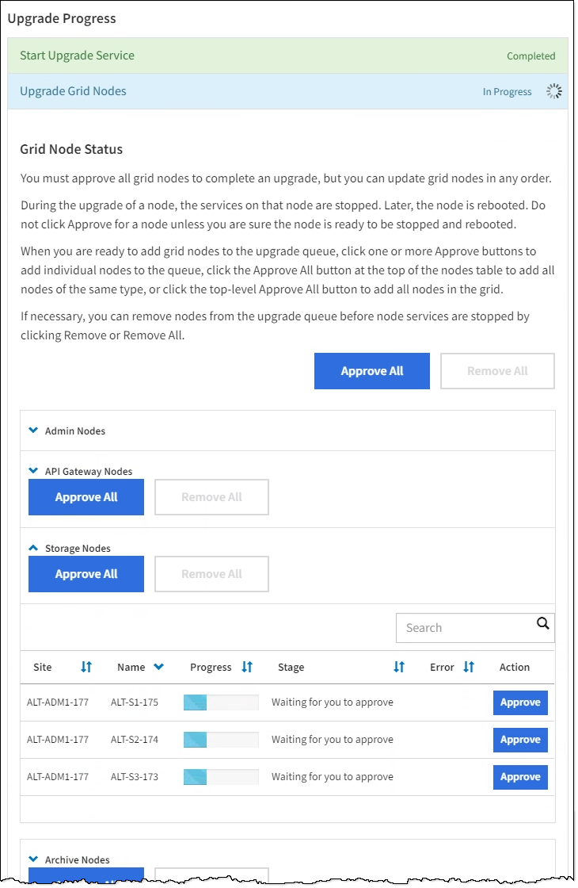
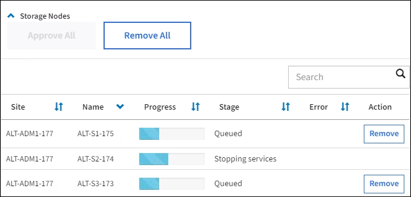

= Eseguire l'aggiornamento
:allow-uri-read: 
:icons: font
:imagesdir: ../media/

[role="lead"]
Quando si è pronti per eseguire l'aggiornamento, selezionare `.upgrade` archiviare e inserire la passphrase di provisioning. Come opzione, è possibile eseguire i controlli preliminari dell'aggiornamento prima di eseguire l'aggiornamento effettivo.

.Di cosa hai bisogno
Hai esaminato tutte le considerazioni e completato tutte le fasi di pianificazione e preparazione.

== Caricare il file di aggiornamento

. Accedere a Grid Manager utilizzando un xref:../admin/web-browser-requirements.adoc[browser web supportato].
. Selezionare *manutenzione* > *sistema* > *aggiornamento software*.
+
Viene visualizzata la pagina Software Update (aggiornamento software).

. Selezionare *aggiornamento StorageGRID*.
. Nella pagina aggiornamento StorageGRID, selezionare `.upgrade` archiviare.
+
.. Selezionare *Sfoglia*.
.. Individuare e selezionare il file: `NetApp_StorageGRID_11.6.0_Software_uniqueID.upgrade`
.. Selezionare *Apri*.
+
Il file viene caricato e validato. Al termine del processo di convalida, viene visualizzato un segno di spunta verde accanto al nome del file di aggiornamento.

. Inserire la passphrase di provisioning nella casella di testo.
+
I pulsanti *Esegui pre-controlli* e *Avvia aggiornamento* diventano abilitati.

+
image::../media/storagegrid_upgrade_buttons_enabled.png[Pulsanti di aggiornamento StorageGRID attivati]

== Eseguire i controlli preliminari

In alternativa, è possibile convalidare le condizioni del sistema prima di avviare l'aggiornamento effettivo. Selezionando *Esegui pre-controlli* è possibile rilevare e risolvere i problemi prima di avviare l'aggiornamento. Le stesse verifiche preliminari vengono eseguite all'avvio dell'aggiornamento. Gli errori di pre-controllo arrestano il processo di aggiornamento e alcuni potrebbero richiedere il coinvolgimento del supporto tecnico per la risoluzione.

. Selezionare *Esegui controlli preliminari*.
. Attendere il completamento dei controlli preliminari.
. Seguire le istruzioni per risolvere eventuali errori di pre-controllo segnalati.
+

IMPORTANT: Se sono state aperte porte firewall personalizzate, viene inviata una notifica durante la convalida del controllo preliminare. È necessario contattare il supporto tecnico prima di procedere con l'aggiornamento.

== Avviare l'aggiornamento e aggiornare il nodo di amministrazione primario

All'avvio dell'aggiornamento, vengono eseguiti i controlli preliminari dell'aggiornamento e viene aggiornato il nodo di amministrazione primario, che include l'interruzione dei servizi, l'aggiornamento del software e il riavvio dei servizi. Non è possibile accedere a Grid Manager durante l'aggiornamento del nodo di amministrazione primario. Anche i registri di controllo non saranno disponibili. L'aggiornamento può richiedere fino a 30 minuti.

. Quando si è pronti per eseguire l'aggiornamento, selezionare *Avvia aggiornamento*.
+
Viene visualizzato un avviso per ricordare che la connessione del browser viene persa quando viene riavviato il nodo di amministrazione principale.

+
image::../media/software_upgrade_connection_will_be_lost.png[La connessione per l'aggiornamento del software verrà persa]

. Selezionare *OK* per confermare l'avviso e avviare il processo di aggiornamento.
. Attendere l'esecuzione delle verifiche preliminari dell'aggiornamento e l'aggiornamento del nodo di amministrazione primario.
+

NOTE: Se vengono segnalati errori di pre-controllo, risolverli e selezionare di nuovo *Avvia aggiornamento*.

+
Durante l'aggiornamento del nodo di amministrazione primario, vengono visualizzati più messaggi *503: Servizio non disponibile* e *problema di connessione al server*, che è possibile ignorare.

+
image::../media/software_upgrade_503_error.png[Errore aggiornamento software 503]

+
image::../media/software_upgrade_problem_connecting_error.png[Problema di aggiornamento software errore di connessione]

. Quando viene visualizzato il messaggio *400: Bad Request*, passare alla fase successiva. L'aggiornamento di Admin Node è stato completato.
+
image::../media/software_upgrade_400_error.png[Errore aggiornamento software 400]

== Cancellare la cache del browser e accedere nuovamente

. Una volta aggiornato il nodo di amministrazione principale, cancellare la cache del browser Web e accedere nuovamente.
+
Per istruzioni, consultare la documentazione del browser Web.

+

IMPORTANT: È necessario cancellare la cache del browser Web per rimuovere le risorse obsolete utilizzate dalla versione precedente del software.

+
Viene visualizzata l'interfaccia di Grid Manager riprogettata, che indica che il nodo di amministrazione primario è stato aggiornato.

+
image::../media/grid_manager_dashboard.png[Dashboard di Grid Manager]

. Dalla barra laterale, selezionare *MANUTENZIONE* per aprire il menu manutenzione.
. Nella sezione *sistema*, selezionare *aggiornamento software*.
. Nella sezione *aggiornamento StorageGRID*, selezionare *aggiornamento*.
. Consultare la sezione avanzamento dell'aggiornamento nella pagina aggiornamento StorageGRID, che fornisce informazioni su ciascuna delle principali attività di aggiornamento.
+
.. *Start Upgrade Service* è la prima attività di upgrade. Durante questa attività, il file software viene distribuito ai nodi grid e viene avviato il servizio di aggiornamento.
.. Una volta completata l'attività *Avvia servizio di upgrade*, viene avviata l'attività *Aggiorna nodi griglia*.
.. Durante l'attività *Upgrade Grid Nodes* (Aggiorna nodi griglia), viene visualizzata la tabella Grid Node Status (Stato nodo griglia) che mostra la fase di aggiornamento per ciascun nodo della griglia nel sistema.

== Scarica Recovery Package e aggiorna tutti i nodi grid

. Una volta visualizzati i nodi della griglia nella tabella Grid Node Status (Stato nodo griglia), ma prima di approvare i nodi della griglia, xref:obtaining-required-materials-for-software-upgrade.adoc#download-the-recovery-package[Scaricare una nuova copia del pacchetto di ripristino].
+

IMPORTANT: È necessario scaricare una nuova copia del file del pacchetto di ripristino dopo aver aggiornato la versione software sul nodo di amministrazione primario. Il file Recovery Package consente di ripristinare il sistema in caso di errore.

. Esaminare le informazioni nella tabella Grid Node Status (Stato nodo griglia). I nodi della griglia sono disposti in sezioni per tipo: Nodi di amministrazione, nodi gateway API, nodi di storage e nodi di archivio.
+

+
Un nodo della griglia può trovarsi in una di queste fasi quando viene visualizzata per la prima volta questa pagina:

+
** Fine (solo nodo amministratore primario)
** Preparazione dell'aggiornamento
** Download del software in coda
** Download in corso
** In attesa di approvazione

. Approvare i nodi della griglia che si desidera aggiungere alla coda di aggiornamento.
+

IMPORTANT: Quando l'aggiornamento inizia su un nodo grid, i servizi su quel nodo vengono interrotti. In seguito, il nodo Grid viene riavviato. Per evitare interruzioni del servizio per le applicazioni client che comunicano con il nodo, non approvare l'aggiornamento per un nodo a meno che non si sia certi che il nodo sia pronto per essere arrestato e riavviato. Se necessario, pianificare una finestra di manutenzione o avvisare i clienti.

+
È necessario aggiornare tutti i nodi grid nel sistema StorageGRID, ma è possibile personalizzare la sequenza di aggiornamento. È possibile approvare singoli nodi griglia, gruppi di nodi griglia o tutti i nodi griglia.

+
Se l'ordine in cui i nodi vengono aggiornati è importante, approvare i nodi o i gruppi di nodi uno alla volta e attendere il completamento dell'aggiornamento su ciascun nodo prima di approvare il nodo o il gruppo di nodi successivo.

+
** Selezionare uno o più pulsanti *approva* per aggiungere uno o più nodi singoli alla coda di aggiornamento. Se si approvano più nodi dello stesso tipo, questi verranno aggiornati uno alla volta.
** Selezionare il pulsante *approva tutto* all'interno di ciascuna sezione per aggiungere tutti i nodi dello stesso tipo alla coda di aggiornamento.
** Selezionare il pulsante di primo livello *approva tutto* per aggiungere tutti i nodi della griglia alla coda di aggiornamento.
** Selezionare *Rimuovi* o *Rimuovi tutto* per rimuovere uno o tutti i nodi dalla coda di aggiornamento. Non è possibile rimuovere un nodo quando il suo Stage raggiunge *arresto dei servizi*. Il pulsante *Remove* è nascosto.
+

. Attendere che ciascun nodo esegua le fasi di aggiornamento, che includono Accodamento, interruzione dei servizi, arresto del container, pulizia delle immagini Docker, aggiornamento dei pacchetti del sistema operativo di base, riavvio, esecuzione dei passaggi dopo il riavvio, avvio dei servizi e fine.
+

NOTE: Quando un nodo appliance raggiunge la fase di aggiornamento dei pacchetti del sistema operativo di base, il software di installazione dell'appliance StorageGRID viene aggiornato. Questo processo automatizzato garantisce che la versione del programma di installazione dell'appliance StorageGRID rimanga sincronizzata con la versione del software StorageGRID.

== Aggiornamento completo

Quando tutti i nodi della griglia hanno completato le fasi di aggiornamento, l'attività *Upgrade Grid Nodes* viene visualizzata come completata. Le restanti attività di aggiornamento vengono eseguite automaticamente e in background.

. Non appena l'attività *attiva funzionalità* viene completata (che si verifica rapidamente), iniziare a utilizzare le nuove funzionalità della versione aggiornata di StorageGRID.
. Durante l'attività *Upgrade Database* (Aggiorna database), il processo di aggiornamento controlla ciascun nodo per verificare che il database Cassandra non debba essere aggiornato.
+

NOTE: L'aggiornamento da StorageGRID 11.5 a 11.6 non richiede un aggiornamento del database Cassandra; tuttavia, il servizio Cassandra verrà arrestato e riavviato su ciascun nodo di storage. Per le future versioni delle funzionalità di StorageGRID, il completamento della fase di aggiornamento del database Cassandra potrebbe richiedere diversi giorni.

. Una volta completata l'attività *Upgrade Database*, attendere alcuni minuti per il completamento dell'attività *Final Upgrade Steps*.
+
Una volta completata l'attività Final Upgrade Steps, l'aggiornamento viene eseguito.

== Confermare l'aggiornamento

. Verificare che l'aggiornamento sia stato completato correttamente.
+
.. Nella parte superiore di Grid Manager, selezionare l'icona della guida e selezionare *About* (informazioni su).
.. Verificare che la versione visualizzata sia quella che ci si aspetta.
.. Selezionare *MANUTENZIONE* > *sistema* > *aggiornamento software*.
.. Nella sezione *aggiornamento StorageGRID*, selezionare *aggiornamento*.
.. Verificare che il banner verde indichi che l'aggiornamento del software è stato completato alla data e all'ora prevista.
+
image::../media/software_upgrade_done.png[Aggiornamento software completato]

. Dalla pagina aggiornamento StorageGRID, determinare se sono disponibili aggiornamenti rapidi per la versione corrente di StorageGRID.
+

NOTE: Se non viene visualizzato alcun percorso di aggiornamento, il browser potrebbe non essere in grado di raggiungere il sito di supporto NetApp. In alternativa, la casella di controllo *Controlla aggiornamenti software* nella pagina AutoSupport (*SUPPORT* > *Tools* > *AutoSupport*) potrebbe essere disattivata.

. Se è disponibile una correzione rapida, scaricare il file. Quindi, utilizzare xref:../maintain/storagegrid-hotfix-procedure.adoc[Procedura di hotfix StorageGRID] per applicare la correzione rapida.
. Verificare che le operazioni della griglia siano tornate alla normalità:
+
.. Verificare che i servizi funzionino normalmente e che non siano presenti avvisi imprevisti.
.. Verificare che le connessioni client al sistema StorageGRID funzionino come previsto.

